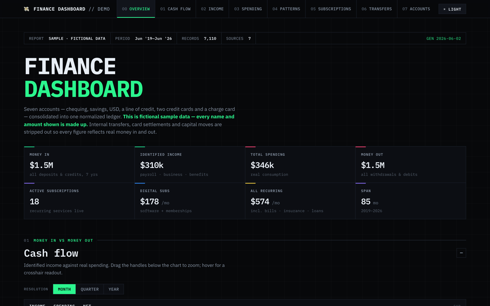
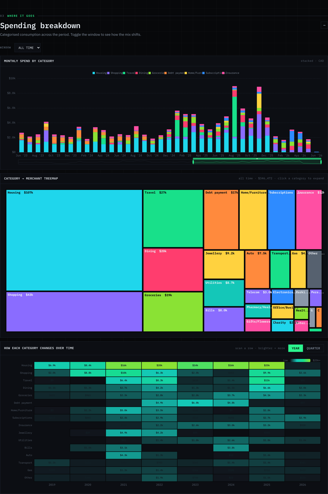
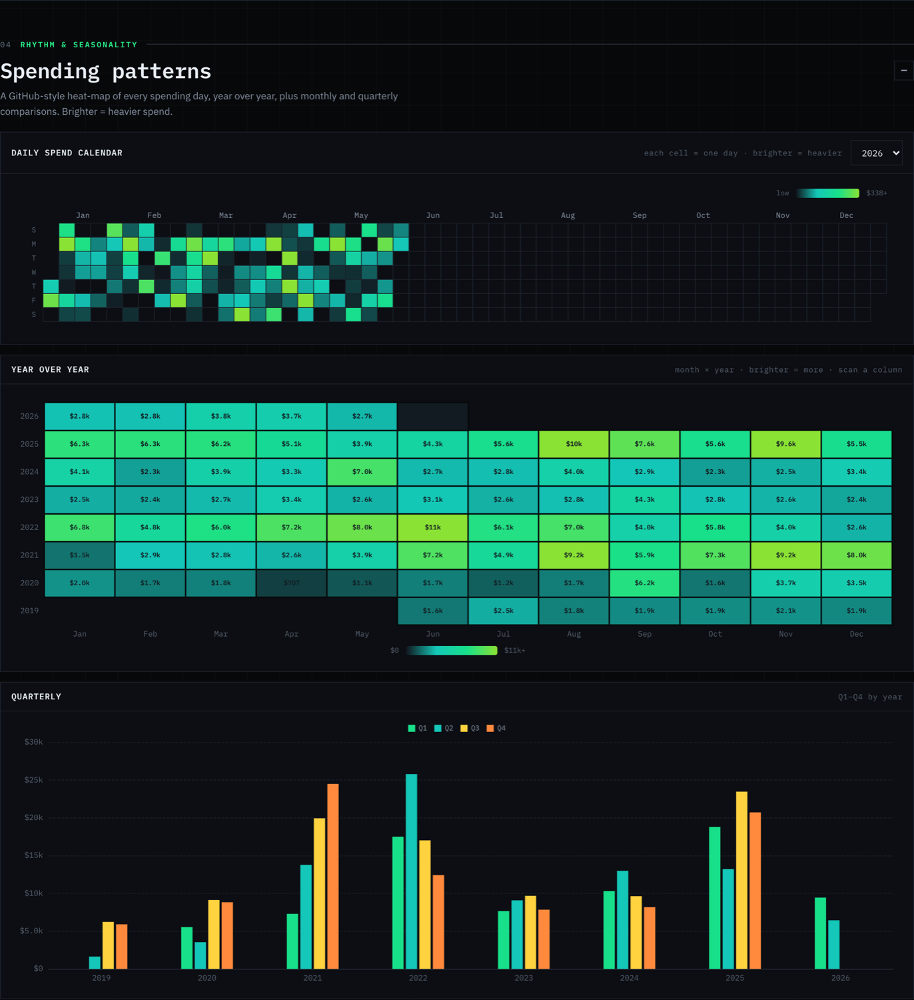
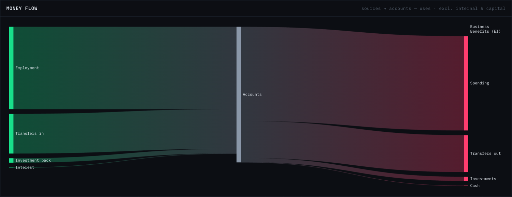
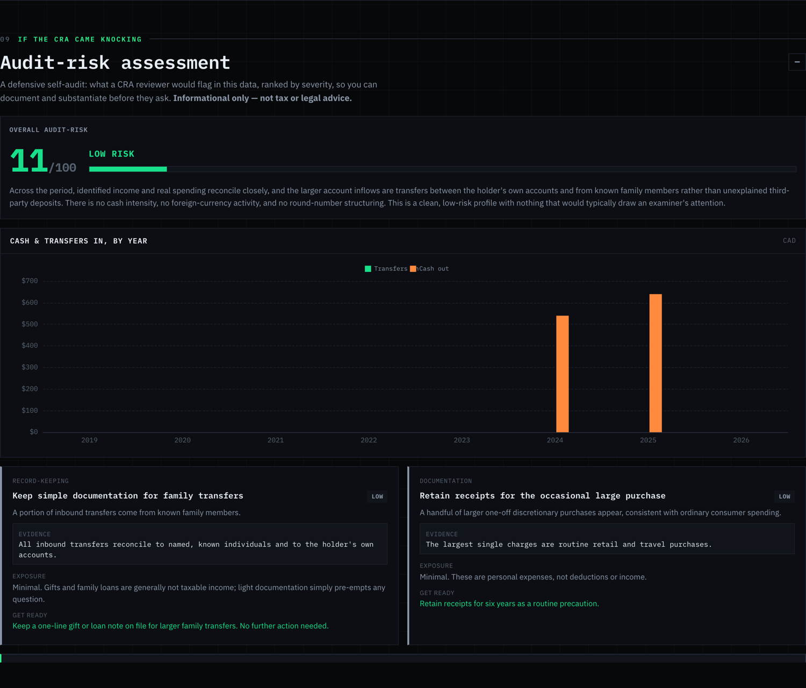

<div align="center">

# 💸 Finance Dashboard

**Drop a folder of bank statements into [Claude Code](https://claude.com/claude-code), paste one prompt, and get a single offline dashboard** that finds every subscription, separates real spending from transfers, and flags audit risk.

Free · open-source · runs **100% on your machine** — nothing is ever uploaded.

[](LICENSE)
[](https://claude.com/claude-code)
[](https://github.com/MahmoudHalat/claude-finance-dashboard)

[**▶ Live demo**](https://finance.mahmoudhalat.com/demo) · [**⌘ The one-shot prompt**](PROMPT.md) · [**How it works**](#-how-it-works) · [**Build your own**](#-build-your-own)

</div>

<br>



> [!NOTE]
> **This repo is the one-shot prompt + a fictional demo of what it builds.** Every name and number in
> the demo ([`public/dashboard.html`](public/dashboard.html)) is **synthetic sample data** — it exists
> to show you what *you* can build. Your real dashboard is generated on your own computer and never
> leaves it.

---

## 🧠 How it works

The thing that confuses people first: **you don't run a pre-written program.** You hand Claude Code two
things — *your statements* and *the prompt in this repo* — and Claude **writes a small local pipeline**
that turns your files into a dashboard, adapting to whatever columns your bank happens to use.

```
   your CSV / XLS / XLSX exports          ┌─────────────────────────────┐
   (chequing, savings, every card)  ──▶   │  Claude Code + PROMPT.md     │
                                          │                             │
   this repo (optional head start):       │  writes & runs a local      │   ──▶   Financial-Dashboard.html
   • public/dashboard.html  (renderer)──▶ │  Python pipeline:           │         one offline file,
   • DATA_CONTRACT.md       (data shape)  │  parse → classify → render  │         opens by double-click
                                          └─────────────────────────────┘
```

Everything runs on your machine. The prompt explicitly tells Claude **never** to send your financial
data anywhere, and the dashboard it produces inlines its chart library + data into one self-contained
HTML file you can open offline forever.

**Why isn't the pipeline code in this repo?** On purpose. A finished pipeline would carry the original
author's real merchant/category rules — Claude writes a fresh one tuned to *your* banks instead. What
this repo reuses is the finished **renderer** and the **data contract** it draws from.

## 📊 What you get

A single-page, quant-terminal-styled report (one offline HTML file) that:

- **Consolidates every account** — chequing, savings, USD, line of credit, every credit card — into one
  normalized ledger, reconciled against statement totals where they're printed.
- **Counts spending honestly.** Every transaction is *flow-typed*, so moving money between your own
  accounts and paying a credit-card bill are **never** miscounted as spending.
- **Finds every subscription** — a curated catalog plus a recurrence detector: true monthly run-rate,
  active-or-lapsed status, and a per-service timeline.
- **Shows where the money goes** — stacked spend-by-category, a drill-down treemap, a GitHub-style daily
  calendar heatmap, a money-flow Sankey, and a per-counterparty timeline.
- **Self-audits** — a defensive "if you got audited, what would be flagged?" risk read, ranked by
  severity with the evidence. *(Informational, not tax advice.)*

<table>
  <tr>
    <td width="50%"></td>
    <td width="50%"></td>
  </tr>
  <tr>
    <td width="50%"></td>
    <td width="50%"></td>
  </tr>
</table>

## 🛠 Build your own

You need [Claude Code](https://claude.com/claude-code) installed. Then:

```bash
git clone https://github.com/MahmoudHalat/claude-finance-dashboard
cd claude-finance-dashboard

# 1. Export CSV / XLS / XLSX from your bank + card portals and drop them in this folder.
#    Don't rename or pre-clean them — Claude reads them as-is.
# 2. Open Claude Code here.
# 3. Paste the prompt from PROMPT.md.
```

Claude builds the pipeline, fills it with your numbers, and produces your dashboard as a single HTML
file. Open it in any browser. That's it.

> **Tip:** the more accounts you give it (chequing, savings, *every* card), the better the
> consolidation. One bank or seven — it adapts the same way.

### Two ways to run — same prompt

| | What happens | When |
|---|---|---|
| **Scaffold from this repo** *(recommended)* | Claude reuses [`public/dashboard.html`](public/dashboard.html) as the renderer and [`DATA_CONTRACT.md`](DATA_CONTRACT.md) as the target shape, so it only builds the pipeline that fills it. You get the demo's **exact** design with your data. | You cloned this repo. |
| **From scratch** | Paste the same prompt into an empty folder; Claude builds the renderer too, adapting to whatever you've got. | No repo, just the prompt. |

## 📁 What's in this repo

| Path | What it is |
|---|---|
| [`PROMPT.md`](PROMPT.md) | The one-shot prompt — the heart of the project. Copy/paste this into Claude Code. |
| [`DATA_CONTRACT.md`](DATA_CONTRACT.md) | The exact `window.FIN` data shape the renderer reads, key by key (used when scaffolding). |
| [`public/dashboard.html`](public/dashboard.html) | The finished renderer **and** the fictional live demo (synthetic data, ECharts inlined). |
| `public/screenshots/` | The images used in this README. |

The Python pipeline is **deliberately not here** (see [How it works](#-how-it-works)).

## 🔒 Privacy

Everything runs locally. The prompt instructs Claude, in writing, never to send your financial data to
any external service; the generated dashboard is one offline file with no network calls; and the demo
published here is entirely synthetic. Your numbers never leave your machine unless *you* choose to share
an anonymized copy. The included [`.gitignore`](.gitignore) also blocks `*.csv`/`*.xls`/`data/` and
pipeline output so you can't accidentally commit your real statements.

## ❤️ Built by

This tool is free because it's a demonstration, built and maintained by:

| | |
|---|---|
| **[Space & Story](https://spaceandstory.co)** | An AEO-first web studio — sites and tools designed to get found by Google **and** AI search. This dashboard is a working sample. |
| **[GiveFeedback](https://givefeedback.dev)** | A lightweight way to collect, triage, and act on product feedback. |
| **[Mahmoud Halat](https://mahmoudhalat.com)** | Everything else I build, write, and ship. |

## ⭐ Contributing

It's open-source and gets sharper every time someone adds their bank's quirks. A
[star](https://github.com/MahmoudHalat/claude-finance-dashboard) helps others find it; PRs are even
better — see [CONTRIBUTING.md](CONTRIBUTING.md).

## License

[MIT](LICENSE). Built with [Claude Code](https://claude.com/claude-code). Not financial or tax advice.
